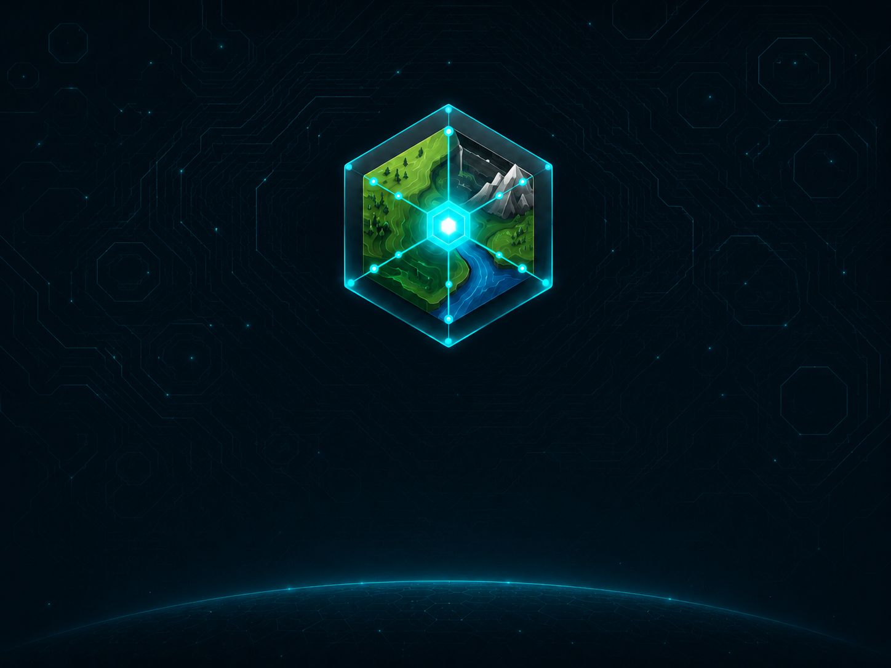

<p align="center">
  
</p>

<h1 align="center">NexaMap Editor</h1>

<p align="center">
  <strong>Create. Convert. Build Worlds.</strong><br />
  A modern desktop environment for creating, editing and converting OTBM maps.
</p>

<div align="center">


[](https://github.com/Skyyzyy/RME-ZONES/actions/workflows/clang-format.yml)
[](LICENSE.rtf)

</div>

---

## Overview

NexaMap Editor is a native C++ map-editing application designed for professional OpenTibia world development. It combines established OTBM editing workflows with modern conversion tools, a responsive wxWidgets interface and a focused welcome experience.

The editor is intended for projects that need reliable map creation, format migration and large-world maintenance without compromising existing map data.

## Highlights

| Area | Capabilities |
|---|---|
| Map editing | Create and maintain cities, hunting grounds, dungeons, mountains, castles and complete OTBM worlds |
| Visual tools | Brushes, palettes, workspaces, search tools, zones and procedural map generation |
| Map conversion | Convert supported maps and item identifiers between ServerID and ClientID workflows |
| Spawn and NPC conversion | Convert supported spawn and NPC files for TFS, Canary and Crystal-based projects |
| Project access | Open recent maps directly from the welcome screen with keyboard and mouse support |
| Interface | DPI-aware native desktop UI with System, Dark and Light editor themes |
| Performance | Cached visual resources and optimized editing workflows for large maps |

## Welcome Screen

The NexaMap welcome screen provides direct access to:

- **New Map** — start a new OTBM project.
- **Open Project** — open an existing map from disk.
- **Map Converter** — access map and item-ID conversion tools.
- **Spawn / NPC Converter** — convert supported spawn and NPC formats.
- **Preferences** — configure the editor, client assets and appearance.
- **Recent Projects** — reopen recently used maps from a scrollable project list.

The welcome screen keeps its NexaMap dark visual identity. The System, Dark and Light options control the main editor appearance after the application is restarted.

## Requirements

- A C++20-compatible compiler.
- CMake 3.10 or newer for CMake-based builds.
- wxWidgets with the `html`, `aui`, `gl`, `adv`, `core`, `net` and `base` components.
- OpenGL and Zlib.
- The dependencies declared in [`vcpkg.json`](vcpkg.json).
- Compatible client assets for the protocol and client version you intend to edit.

## Compilation

### Windows — Visual Studio and vcpkg

Install [vcpkg](https://github.com/microsoft/vcpkg) and enable Visual Studio integration:

```powershell
git clone https://github.com/microsoft/vcpkg.git
cd vcpkg
.\bootstrap-vcpkg.bat
.\vcpkg.exe integrate install
```

Clone NexaMap Editor:

```powershell
git clone https://github.com/Skyyzyy/RME-ZONES.git NexaMap-Editor
cd NexaMap-Editor
```

Open [`vcproj/Editor.sln`](vcproj/Editor.sln), select the required platform (`x64` is recommended) and choose either the `Debug` or `Release` configuration.

The Visual Studio project uses manifest mode through [`vcpkg.json`](vcpkg.json), allowing required libraries to be restored through vcpkg. Install the MSVC toolset declared by the project, or deliberately retarget the solution to a compatible toolset available in your Visual Studio installation.

### Windows — CMake

Set `VCPKG_ROOT` to your vcpkg directory, then configure the project with the vcpkg toolchain:

```powershell
$env:VCPKG_ROOT = "C:\path\to\vcpkg"

cmake -S . -B out/build/release -G Ninja `
  -DCMAKE_BUILD_TYPE=Release `
  -DCMAKE_TOOLCHAIN_FILE="$env:VCPKG_ROOT/scripts/buildsystems/vcpkg.cmake"

cmake --build out/build/release
cmake --install out/build/release --prefix out/install/release
```

### Linux — CMake and vcpkg

Install Git, CMake, Ninja, a C++20 compiler and the development packages required by OpenGL and your desktop environment. Package names vary by distribution.

Bootstrap vcpkg, then configure NexaMap Editor with its toolchain file:

```bash
git clone https://github.com/microsoft/vcpkg.git
./vcpkg/bootstrap-vcpkg.sh

git clone https://github.com/Skyyzyy/RME-ZONES.git NexaMap-Editor
cd NexaMap-Editor

cmake -S . -B out/build/release -G Ninja \
  -DCMAKE_BUILD_TYPE=Release \
  -DCMAKE_TOOLCHAIN_FILE="../vcpkg/scripts/buildsystems/vcpkg.cmake"

cmake --build out/build/release --parallel
cmake --install out/build/release --prefix out/install/release
```

If vcpkg was cloned somewhere else, update `CMAKE_TOOLCHAIN_FILE` to point to that installation.

## Resource Layout

Official NexaMap visual resources are stored in the repository under:

```text
data/images/
data/images/welcome/
```

During development, the editor resolves welcome-screen resources from the repository. These files should not be manually generated or duplicated inside Visual Studio `Debug` or `Release` output directories. CMake install rules package the required welcome assets for installed builds.

## First Launch

1. Start NexaMap Editor.
2. Open **Preferences**.
3. Configure the client version and the compatible client data required by your project.
4. Create a new map or open an existing `.otbm` project.
5. Keep a backup before converting maps, item identifiers, spawns or NPC files between server formats.

## Contributing

Bug reports and focused pull requests are welcome.

When contributing:

- Keep changes limited to a clear purpose.
- Preserve OTBM compatibility and existing map data unless a migration is explicitly documented.
- Keep specialized or experimental workflows optional when they are not appropriate for every user.
- Follow the existing C++20 and wxWidgets conventions, including normal parent-owned control lifetime.
- Preserve keyboard navigation, accessibility and DPI behavior when changing the interface.
- Do not commit executables, compiler output, logs, temporary files or duplicated build resources.
- Describe the affected workflow and the manual validation performed in the pull request.

Before submitting a change, review the diff, apply the repository formatting rules and validate the affected workflow on each platform you support.

## Support and Feedback

Use [GitHub Issues](https://github.com/Skyyzyy/RME-ZONES/issues) to report reproducible problems or propose focused improvements. Include the editor version, operating system, client version and clear reproduction steps when reporting a defect.

## Credits

NexaMap Editor is developed by [Mateuzkl](https://github.com/Mateuzkl) and [Skyyzyy](https://github.com/Skyyzyy).

## License

See [`LICENSE.rtf`](LICENSE.rtf) for the terms that apply to this repository and its distributions.

<p align="center">
  <strong>NexaMap Editor 5.0.0</strong><br />
  Create. Convert. Build Worlds.
</p>
