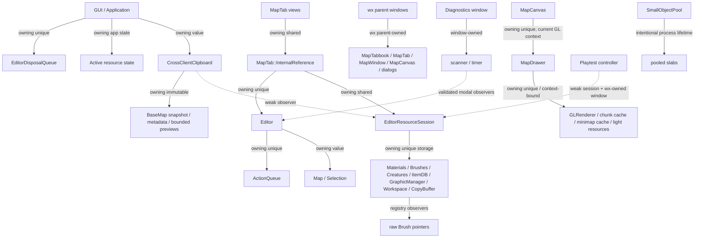

# NexaMap Editor — auditoria completa da PR #25

Data da auditoria: 2026-09-05

## Baseline

- PR: `#25`, branch final `nexamap-layout-redesign`.
- Base da PR: `e5d75c1c7c8a5d7ecceaffc796d0696d1fc77458` (`main`).
- HEAD antes das correções: `27a1ec533dc10a920e2c2afb41358490722fb235`.
- HEAD de código com todas as correções, testes e clang-format desta auditoria: `fa8154e518a48919ef22e88b6c118cba660cb2a7`.
- Escopo original: 38 commits, 519 arquivos no diff de PR (`main...HEAD`), 21.522 adições e 1.813.897 remoções.
- Escopo final de código/teste: 524 arquivos no diff de PR, 21.950 adições e 1.813.979 remoções. A maior parte das remoções é a retirada de bancos de itens versionados na própria PR.
- Método: inventário dos 38 commits por intenção e arquivos, busca automatizada no diff agregado e revisão manual dos pontos de ownership, callbacks, threads, sockets, sessões, clipboard, diagnósticos, minimapa, playtest e OpenGL no estado final da árvore. A árvore final foi tratada como autoridade quando um caminho intermediário já havia sido substituído.
- Alterações que já existiam no checkout do usuário antes da auditoria: `data/editor/borders.xml`, `source/server_workspace.cpp`, `build.loading-tooltip.log` e `build.playtest-validation-output.log`. Elas ficaram fora dos commits da auditoria.
- Compilador: MSVC 14.51.36231, Visual Studio 18 2026, toolset v145, x64 Release, C++20; wxWidgets 3.3.1.
- OpenGL real: 4.6, Intel(R) UHD Graphics, driver 27.20.100.9664.
- Configuração de validação: `BUILD_TESTING=ON`, `ENABLE_MULTIPLAYER_SESSION_TESTS=ON` e `ENABLE_GL_CACHE_TESTS=ON`.

O baseline não compilava o executável principal em Unity Build. O conjunto final compila o editor e todos os alvos de teste e passa em 35 de 35 testes.

## Grafo de ownership confirmado



O destrutor do `MapCanvas` torna o contexto compartilhado atual antes de destruir o `MapDrawer`. Dentro do `MapDrawer`, a ordem dos membros mantém o `GLRenderer` vivo enquanto caches dependentes liberam objetos GL. Não foi introduzido nenhum ciclo de `shared_ptr`.

## Findings e correções

### F-01 — P1: colisão de helper no Unity Build

- **Arquivo/função:** `source/spawn_xml_converter.cpp`, helper anônimo `IsRegularFile`; colisão com `source/server_workspace.cpp`.
- **Problema:** dois helpers com o mesmo nome e assinatura caíam na mesma unidade Unity.
- **Por que era perigoso:** impedia a compilação Release x64 do executável principal, embora alguns alvos de teste usassem agrupamentos Unity diferentes e compilassem.
- **Prova:** o build baseline falhou exatamente quando o Unity unit 15 reuniu os dois arquivos.
- **Correção:** os helpers receberam nomes específicos, `IsRegularSpawnFile` no conversor e `IsServerWorkspaceFile` no workspace, e seus usos foram atualizados. Duas definições `inline` nos `.cpp` ainda colidiriam dentro da mesma translation unit Unity.
- **Teste de regressão:** build completo Release x64 passou, incluindo `NexaMap Editor.exe`.

### F-02 — P0: término duplicado de frame no `MapDrawer`

- **Arquivo/função:** `source/map_drawer.cpp`, `MapDrawer::SetupGL`, `MapDrawer::Release` e `MapDrawer::~MapDrawer`.
- **Problema:** o caminho normal encerrava o frame e o destrutor chamava `Release()` novamente. Isso podia executar `glPopMatrix` e trabalho de fim de frame sem um frame ativo.
- **Por que era perigoso:** produzia estado GL desequilibrado durante o fechamento e podia contaminar ou interromper a destruição de renderer, FBO e caches.
- **Prova:** o teste de teardown real falhava antes da correção com erro OpenGL ao destruir depois do fim normal do frame.
- **Correção:** `Release()` agora verifica e limpa `frame_started_valid`, encerrando cada frame no máximo uma vez. A destruição dos recursos continua ocorrendo com o contexto correto, sem GL em thread de fundo.
- **Teste de regressão:** `renderer_lifecycle_tests` executa 100 ciclos de criação/desenho/encerramento/destruição; `playtest_integration_tests` cobre fechamento de Playtest e abas com GL real.

### F-03 — P1: refcount manual e destruição não rastreada do `Editor`

- **Arquivo/função:** `source/map_tab.h`, `source/map_tab.cpp`, `MapTab::InternalReference` e fechamento da última view.
- **Problema:** views compartilhavam um ponteiro cru com `owner_count` manual. A última view disparava `delete Editor` em `std::thread(...).detach()`.
- **Por que era perigoso:** incremento/decremento manual não era exception-safe; a thread destacada podia sobreviver ao shutdown de globais, sessões e infraestrutura da aplicação.
- **Prova:** o ownership dependia de cada caminho de destruição wx acertar o contador, e não existia join/drain para o worker destacado.
- **Correção:** as views agora compartilham um `std::shared_ptr<InternalReference>`; o estado possui o `Editor` com `std::unique_ptr` e mantém a sessão com ownership compartilhado. A última view transfere o `Editor` para uma fila da aplicação com `std::jthread`; o shutdown para, drena e faz join. A janela de Playtest e os filhos wx são removidos sincronamente antes dessa transferência.
- **Teste de regressão:** 100 ciclos com duas views da mesma edição, fechamento nas duas ordens e contador atômico comprovando uma única destruição; `DrainEditorDisposalsForTests()` confirma fila vazia.

### F-04 — P2: owners únicos expressos como ponteiros crus

- **Arquivo/função:** `Editor::actionQueue`, buffers doodad de GUI/sessão e `GraphicManager::animation_timer`.
- **Problema:** objetos com um único owner usavam `new/delete` manual.
- **Por que era perigoso:** deixava transferência, ordem de destruição e caminhos de exceção implícitos, especialmente durante o novo fluxo de descarte do editor.
- **Prova:** cada alocação tinha exatamente um delete correspondente e nenhum consumidor precisava compartilhar ownership.
- **Correção:** `ActionQueue` e os `BaseMap` de buffer passaram a `std::unique_ptr`; o cronômetro passou a membro por valor. A sintaxe `editor.actionQueue->...` foi preservada.
- **Teste de regressão:** build completo, suíte de editor, clipboard, sessão, collections e playtest.

### F-05 — P1: `CallAfter` capturando janelas por `this` cru

- **Arquivo/função:** `MapTabbook`, Favorites DPI, Zones, Quick Command Palette e `ReplaceRuleBuilderPanel`.
- **Problema:** callbacks diferidos capturavam `this`; testar `IsBeingDeleted()` dentro do callback não ajudava se o objeto já tivesse sido destruído.
- **Por que era perigoso:** fechar aba/paleta durante um evento enfileirado podia resultar em use-after-free. Zones também podia usar um brush global trocado antes da execução.
- **Prova:** busca por `CallAfter([this` encontrou os cinco caminhos em janelas que podem ser fechadas ou recriadas.
- **Correção:** captura por `wxWeakRef`, validação antes do acesso e nova leitura do zone brush no momento da execução. A busca final por `CallAfter([this` nos fontes alterados não retorna ocorrências.
- **Teste de regressão:** startup, Favorites, Collections/Zones, Replace Rule e lifecycle nativo com troca e fechamento de abas.

### F-06 — P2: guards duplicados em popup

- **Arquivo/função:** `source/map_display.cpp`, handlers Rotate e Switch Door.
- **Problema:** `PopupCanEdit(editor)` era executado duas vezes em sequência.
- **Por que era ruim:** duplicava lógica de validação e dificultava verificar qual guarda realmente protegia a operação.
- **Prova:** os blocos adjacentes eram equivalentes e o segundo era inalcançável quando o primeiro falhava.
- **Correção:** o segundo bloco foi removido; a validação nova que refaz lookup de contexto/item foi mantida.
- **Teste de regressão:** suíte completa de editor e integração nativa.

### F-07 — P1: clipboard mantinha sessões fechadas vivas

- **Arquivo/função:** `CrossClientClipboard::capture/analyze/apply` e `CrossClientPasteAnalysis`.
- **Problema:** clipboard e análise guardavam `shared_ptr` de origem/destino. Uma sessão carrega registries, sprites, materiais e graphics, portanto copiar e fechar a origem não liberava esse conjunto.
- **Por que era perigoso:** retenção de RAM/VRAM tinha comportamento de leak até limpar ou substituir o clipboard.
- **Prova:** o grafo mostrava o clipboard como owner da sessão, embora o paste já carregasse snapshot imutável, IDs, fingerprints e previews.
- **Correção:** as referências passaram a `weak_ptr`. O snapshot continua colável sem a origem; `apply` valida geração do clipboard e trava/valida a sessão de destino no último momento.
- **Teste de regressão:** o teste copia, remove todos os owners da sessão de origem, comprova `weak_ptr::expired()` e mantém o snapshot disponível.

### F-08 — P1: alocações e retenção excessivas de previews RGBA

- **Arquivo/função:** `GameSprite::getVisualPreviewRGBA` e captura/análise do cross-client clipboard.
- **Problema:** dimensões de sprite não tinham limite de bytes antes de `pixels.assign`, e cada tipo único podia reter o preview completo.
- **Por que era perigoso:** no limite dos campos de dimensão, `255 * 32` por eixo gera 8.160 × 8.160 × 4 = 266.342.400 bytes em uma única tentativa. Muitos itens únicos multiplicavam a retenção.
- **Prova:** cálculo direto dos tipos/campos e ausência de limite no caminho de alocação.
- **Correção:** geração rejeita preview acima de 16 MiB; previews persistidos são reduzidos proporcionalmente para no máximo 16 × 16 RGBA (1.024 bytes cada); o total retido pelo clipboard é limitado a 64 MiB. Fingerprints de matching continuam independentes.
- **Teste de regressão:** um sprite sintético superdimensionado é rejeitado sem alocar a saída; clipboard/matching e integração continuam passando.

### F-09 — P1: diagnósticos retinham resultados e iteradores obsoletos

- **Arquivo/função:** `MapDiagnosticsScanner::Start/Reset` e timer de `MapDiagnosticsWindow`.
- **Problema:** novo scan/limpeza visual não zerava todo o estado interno. O scan incremental mantinha iteradores e ponteiros de `House` enquanto mapa, sessão ou revisão podiam mudar.
- **Por que era perigoso:** mantinha memória de resultados e permitia continuar um scan com observadores inválidos.
- **Prova:** containers, ocorrências e iteradores sobreviviam ao comando Clear; o timer não comparava a revisão capturada com o estado atual.
- **Correção:** `Reset()` limpa iteradores, issues, ocorrências e estado. `Start()` e Clear usam esse caminho. O timer cancela ao detectar outro mapa, sessão, revisão de conteúdo ou revisão multiplayer.
- **Teste de regressão:** scan sintético gera estado, chama `Reset()` e comprova que issues e iteradores foram liberados; suíte de diagnostics passa.

### F-10 — P2: underflow no orçamento do cache GPU

- **Arquivo/função:** `MapChunkRenderCache::makeRoom`.
- **Problema:** `budgetBytes - residentBytes` podia sofrer underflow se o residente já excedesse o orçamento.
- **Por que era perigoso:** o valor unsigned enorme resultante podia permitir nova entrada quando a intenção era remover/recusar.
- **Prova:** condição aritmética no caminho de admissão, independente do driver.
- **Correção:** a função testa primeiro `residentBytes > budgetBytes` e só subtrai quando a operação é válida.
- **Teste de regressão:** testes unitários de chunk e integração GL com cache persistente.

### F-11 — P2: precedência incorreta em membership de tileset

- **Arquivo/função:** `Materials::isInTileset`.
- **Problema:** sem parênteses, a validação de ID condicionava apenas parte da expressão com quatro tipos de brush.
- **Por que era perigoso:** um item inválido podia ser aceito por outro ramo da expressão e contaminar filtros de material/collection.
- **Prova:** precedência de `&&` sobre `||` na expressão original.
- **Correção:** o ID válido agora condiciona o grupo inteiro de brushes.
- **Teste de regressão:** startup, editor data, collections e suíte completa.

### F-12 — P2: remoção de página sem validar `wxNOT_FOUND`

- **Arquivo/função:** remoção de página em `source/palette_window.cpp`.
- **Problema:** o índice retornado pela busca podia ser `wxNOT_FOUND` e ainda seguir para remoção.
- **Por que era perigoso:** índice inválido e child órfão durante troca de resource session.
- **Prova:** o retorno não era validado.
- **Correção:** a página só é removida com índice válido; child sem página é destruído de forma segura.
- **Teste de regressão:** `collections_palette_tests` e ciclos de sessão/aba.

## Mudanças de ownership

| Antes | Depois | Motivo |
|---|---|---|
| `InternalReference*` + `owner_count` | `shared_ptr<InternalReference>` | várias views possuem de fato o mesmo estado |
| `InternalReference::editor` cru | `unique_ptr<Editor>` | um único estado possui o editor |
| `Editor::actionQueue` cru owner | `unique_ptr<ActionQueue>` | ownership único e destruição determinística |
| buffers doodad cru owners | `unique_ptr<BaseMap>` | ownership único; swap/move explícito |
| `GraphicManager::animation_timer` heap | `wxStopWatch` por valor | lifetime igual ao manager |
| sessões fortes no clipboard/análise | `weak_ptr<EditorResourceSession>` | observar sem prolongar registries/graphics |
| thread destacada de `delete Editor` | fila app-owned com `jthread` e drain | shutdown rastreável e joinável |

Permaneceram ponteiros crus onde são observadores: itens/tiles para seus containers durante operações síncronas, brushes pertencentes aos registries, children wx pertencentes ao pai e objetos GL cuja destruição depende do contexto atual. O `SmallObjectPool` continua intencionalmente em lifetime de processo, pois registries e buffers globais ainda podem conter objetos do pool no fim da aplicação; liberá-lo antecipadamente seria incorreto.

## Callbacks, timers, sockets e threads

- `CallAfter`: cinco capturas de `this` foram trocadas por `wxWeakRef`; Zones refaz lookup do brush.
- Timer de diagnostics: agora para/cancela em troca de mapa, sessão ou revisão. O cronômetro de animação do `GraphicManager` é membro por valor.
- Playtest: manteve o padrão já seguro de weak reference; a janela é removida antes da destruição assíncrona dos dados.
- Disposal: a thread destacada foi eliminada; `EditorDisposalQueue` aceita jobs, drena e faz join no shutdown.
- Resolver DNS: não foi alterado. Ele limita quatro resoluções, captura somente hostname e estado compartilhado, não captura janela/sessão, e publica string antes do `done` release/acquire. Fazer join de `getaddrinfo` bloqueante poderia travar o fechamento. O risco residual de processo terminar com resolução do sistema ainda bloqueada está documentado abaixo.
- `ClosingSocket`: não foi alterado. O handler self-owned limita 64 instâncias, desliga eventos, para o timer, destrói o socket uma vez, remove eventos pendentes e agenda a própria destruição. Os testes de rejeição/desconexão e o ASan não mostraram UAF ou double destroy.
- Multiplayer: callbacks de UI já usam `wxWeakRef`; `PropertyRequest::owner` também é weak. Workers de sprite/preloader e geração procedural são joináveis e parados.

## Memória

| Medida | Antes | Depois | Conclusão permitida |
|---|---:|---:|---|
| Sessão de origem retida pelo clipboard | owner forte; sessão não podia expirar | weak observer; teste comprova expiração | retenção lógica corrigida |
| Tentativa máxima de preview individual | até 266.342.400 bytes pelo formato | rejeitada acima de 16 MiB | pico individual limitado |
| Preview persistido por tipo | dimensão integral | até 1.024 bytes (16 × 16 × 4) | retenção por tipo limitada |
| Total de previews persistidos | sem teto explícito | 64 MiB | retenção global limitada |
| Editor fechado | worker detached não observável | fila joinável, drain e destruição exatamente uma vez | lifecycle determinístico |
| 100 ciclos nativos/playtest, working set | não medido no baseline | picos: 83,38 / 83,22 / 83,09 MiB | valor absoluto; sem alegação de redução |
| 100 ciclos, private bytes | não medido no baseline | picos: 39,87 / 39,80 / 39,79 MiB | valor absoluto; sem alegação de redução |

Cada execução começou enquanto o processo ainda carregava (primeira amostra 2,57 MiB de working set) e terminou durante o shutdown, portanto a última amostra não representa um plateau pós-idle. Não havia mapa real representativo fornecido para comparar Classic, Canary e Crystal em RAM/VRAM.

O executável de integração foi compilado com AddressSanitizer do MSVC e passou tanto no ciclo nativo/GL quanto na suíte multiplayer. O ASan do MSVC usado aqui não fornece uma contagem LSan de bytes inalcançáveis. Assim, a evidência de retenção combina instrumentação de UAF/heap com `weak_ptr`, contadores de destruição e drain determinístico; não há alegação de “zero bytes vazados” para o processo inteiro. As páginas do allocator e o object pool de lifetime de processo não foram classificados como leak.

## GPU e cache

| Medida sintética | Baseline | Depois |
|---|---:|---:|
| equivalência de pixels cache OFF/ON | exata | exata |
| upload por frame aquecido OFF → ON | 1.760 → 480 bytes | 1.760 → 480 bytes |
| draw calls OFF → ON | 13 → 13 | 13 → 13 |
| texture binds | 6 | 6 |
| submit OFF, duas rodadas (mediana) | 0,0592 / 0,0632 ms | 0,0674 / 0,0530 ms |
| submit ON, duas rodadas (mediana) | 0,0678 / 0,0499 ms | 0,0567 / 0,0439 ms |

As variações são pequenas e não sustentam uma alegação de ganho de performance desta auditoria. A correção em `makeRoom` é de aritmética/correção. O teste confirma o benefício já existente do cache em bytes de upload e a equivalência visual.

O teardown real passou com FBO/cache ativos e contexto Intel. O token de atlas continua combinando textura e epoch, e os testes cobrem reutilização de `GLuint`. Não há GL em background. Contagem total de objetos GL e VRAM do driver não estavam instrumentadas, então não foram inventadas.

## Performance

| Cenário | Baseline | Depois | Leitura |
|---|---:|---:|---|
| Build completo Release x64 | falha no Unity unit 15 | passa | regressão de build corrigida |
| Suíte final | baseline dividido: 30 unit/GL + 4 integrações | 35/35 em 20,00 s | inclui novo teste, tempos não são comparação direta |
| Multiplayer final | — | 10,79 s | todas as rotas passam |
| Playtest/lifecycle final | — | 3,30 s | inclui 100 ciclos compartilhados |
| Renderer teardown final | falhava na prova específica | 100 ciclos em 1,02 s | correção funcional |
| GL cache final | — | 0,52 s | pixels exatos e métricas acima |

Nenhuma otimização de hot path foi aplicada sem benchmark. `makeRoom` mantém a política de ordem atual porque `prepare` move entradas tocadas/atuais para o fim; não havia prova de scan completo mais rápido. O vetor temporário de polygon/triangle fan também foi mantido, pois não apareceu como gargalo no cenário medido.

## Código morto ou duplicado

- Removidos os guards duplicados de Rotate/Switch Door.
- Removidos o `owner_count` manual e o caminho destacado de `delete Editor`, substituídos pelo ownership efetivo.
- Removidos deletes manuais tornados obsoletos por `unique_ptr`/membro por valor.
- Não houve remoção ampla baseada apenas em `rg`. IDs, settings e APIs possivelmente usados por XML/configuração/extensões foram preservados.
- `setCollection` foi mantido: testes existentes comprovam que ele marca membership e que o mesmo brush pode aparecer em raw e collection; tratá-lo como tipo exclusivo quebraria comportamento válido.

## Auditoria dos 38 commits da PR

| Commit | Intenção verificada | Foco de risco revisto |
|---|---|---|
| `cde6946` | workspace servidor e launcher | filesystem, estado global, callbacks |
| `9cecd52` | retirar version folders e detectar Crystal | compatibilidade e assets |
| `b38425b` | restaurar Crystal/crédito | paths e UI |
| `0c40ef5` | abrir mapa detectado | workspace/map lifetime |
| `5d0b92c` | estilo de crédito | UI |
| `8ef8302` | mensagem da comunidade | UI |
| `86bc485` | encoding do crédito | strings |
| `5c468d7` | clang-format | follow-up de formato |
| `ddb1839` | mapa primário do servidor | scan determinístico |
| `6c6258d` | sessões independentes por aba | grafo de ownership |
| `824e425` | verificação de cross-client paste | retenção, snapshots, matching |
| `193ae9c` | layout do review de paste | wx ownership |
| `0870b4e` | itens ausentes no paste | matching e allocations |
| `282f8c5` | paste grande/múltiplos andares | cópias e bounds |
| `9b261b6` | IDs em busca AID/UID | ponteiros de resultado |
| `47c3407` | loading específico do servidor | sessões/workspace |
| `7618e4e` | warnings Canary | compatibilidade |
| `f0849f1` | Town ID atômico | consistência e undo |
| `c58f233` | merge com main | caminhos duplicados/superseded |
| `db38af1` | clang-format | follow-up de formato |
| `df95132` | multiplayer e seleção de servidor | sockets, timers, callbacks, threads |
| `bacfb7c` | format 16/retirada de guia | follow-up e arquivos mortos |
| `f0eed87` | command palette | CallAfter/foco |
| `24055b6` | Favorites 2.0/sessões | DPI callback e registry observers |
| `308fbc9` | revisões de chunk/diagnóstico | invalidação e overflow |
| `e2de481` | cache persistente/shutdown | GL teardown e eviction |
| `e2c96fc` | minimapa dockável | cache/pages/wx lifecycle |
| `18e7e59` | action e markers AID/UID | bounds e invalidação |
| `57cc674` | scanner de diagnósticos | iteradores/timer/retenção |
| `38cd056` | container preview | RGBA, tooltip e GL/UI |
| `13756c4` | remover item databases | efeito de assets removidos |
| `3b7c2f8` | otimizar Find Item | debounce e callbacks |
| `5e5238e` | pan por espaço/search/scroll | capture/release de input |
| `dbfe2c0` | previews/search/pan lifecycle | callbacks pós-destruição |
| `cd3b5da` | progresso/tooltip independente de zoom | timers e cálculo UI |
| `c21eb38` | multiplayer lifetime/palette startup | follow-up de lifetime |
| `4586005` | playtest local | window, weak refs e GL teardown |
| `27a1ec5` | Collections por resource session | registry/window lifetime |

Os dez commits de correção, testes e estilo desta auditoria na branch são: `7f1fcc8`, `11d89c0`, `229fe5f`, `d2a24c6`, `ddc4d3d`, `8de336b`, `da10b7b`, `af89f17`, `035dfe9` e `fa8154e`.

## Testes e comandos

Configuração completa:

```powershell
cmake -S . -B build-audit -G "Visual Studio 18 2026" -A x64 -T v145 `
  -DCMAKE_TOOLCHAIN_FILE=D:/vcpkg/scripts/buildsystems/vcpkg.cmake `
  -DVCPKG_INSTALLED_DIR="C:/Users/Mateus/Desktop/RME MELHORAR O NEXA/NexaMap-Editor/vcpkg_installed/x64-windows" `
  -DVCPKG_MANIFEST_INSTALL=OFF -DVCPKG_TARGET_TRIPLET=x64-windows `
  -DBUILD_TESTING=ON -DENABLE_MULTIPLAYER_SESSION_TESTS=ON -DENABLE_GL_CACHE_TESTS=ON
cmake --build build-audit --config Release --parallel 4
ctest --test-dir build-audit -C Release --output-on-failure
```

Resultado: no worktree isolado, o build completo passou e 35/35 testes passaram em 20,00 s. Depois de integrar os commits, a mesma configuração foi recompilada no checkout real, incluindo as alterações locais pré-existentes de `borders.xml` e `server_workspace.cpp`; o editor compilou e 35/35 testes passaram em 21,34 s. A lista inclui multiplayer session/protocol, startup, playtest unit/integration, renderer lifecycle, Collections, Favorites, diagnostics, chunk revision/geometry/GL, minimap, overlays, imports, formats, workspace, spawn converter, procedural generator, zones e demais testes determinísticos.

Sanitizer:

```powershell
cmake -S . -B build-asan-final -G "Visual Studio 18 2026" -A x64 -T v145 `
  -DCMAKE_TOOLCHAIN_FILE=D:/vcpkg/scripts/buildsystems/vcpkg.cmake `
  -DVCPKG_INSTALLED_DIR="C:/Users/Mateus/Desktop/RME MELHORAR O NEXA/NexaMap-Editor/vcpkg_installed/x64-windows" `
  -DVCPKG_MANIFEST_INSTALL=OFF -DVCPKG_TARGET_TRIPLET=x64-windows `
  -DBUILD_TESTING=ON -DENABLE_MULTIPLAYER_SESSION_TESTS=ON `
  "-DCMAKE_CXX_FLAGS=/fsanitize=address /Zi /EHsc /FS" `
  "-DCMAKE_EXE_LINKER_FLAGS=/INCREMENTAL:NO"
cmake --build build-asan-final --config Release --target multiplayer_session_tests --parallel 4
multiplayer_session_tests.exe --playtest-validation
multiplayer_session_tests.exe
```

Resultado ASan: as duas execuções terminaram com código 0 e nenhum diagnóstico. O primeiro comando validou adapter Item/Tile, liberação da source session, 100 lifecycles de abas, preview oversized, reset de diagnostics, três temas, resize, câmera/hit test, troca de sessão, F6/ESC, cinco modos de clima e avatar em 80 frames. O segundo validou 13 cenários de host/join/rejeição/reconexão/shutdown/propriedade/DNS/overflow/destruição.

Qualidade do diff:

- `git diff --check`: passou.
- clang-format 16.0.6: os hunks C++ alterados pela auditoria passaram pelo `clang-format-diff.py` com o binário 16. O dry-run de arquivos inteiros ainda encontra violações anteriores da própria PR; por isso o relatório não afirma que toda a árvore histórica foi reformatada.

## Riscos restantes e limites da prova

- Não foi fornecido um mapa grande real Classic/Canary/Crystal. RAM de sessão, VRAM do driver, tempo de abertura e paste de 10k tiles não foram comparados antes/depois.
- A expansão de ranges em Materials pode materializar até 65.536 nós XML. Não foi alterada sem benchmark e sem integrar um formato compacto ao serializer.
- O resolver DNS do sistema continua em worker destacado limitado. Ele não referencia UI/sessão, mas o sistema operacional pode mantê-lo bloqueado durante o término do processo.
- `ClosingSocket` passou nos testes, mas encerrar a aplicação dentro da janela final de dois segundos ainda depende da ordem global de shutdown do wxWidgets.
- Os testes full-editor continuam condicionados a `ENABLE_MULTIPLAYER_SESSION_TESTS`, cujo default é OFF. Isso deixa validações não relacionadas à rede fora da configuração CI padrão; separar esses alvos é uma melhoria de arquitetura de testes futura.
- O build Linux, LSan/Valgrind, contagem de objetos GL e telemetria de VRAM não estavam disponíveis neste host Windows.
- O object pool mantém slabs alcançáveis até o fim do processo de propósito. Só pode ganhar teardown explícito quando todos os owners globais e filas forem provadamente drenados.
- O diff remove grande volume de assets. A auditoria verificou intenção/histórico e build, mas não pode provar compatibilidade com instalações externas que dependiam de arquivos removidos sem os datasets dessas instalações.

Não restou P0/P1 conhecido sem correção ou explicação. Os recursos pedidos pela PR foram preservados, incluindo launcher/workspaces, sessões independentes, TFS/Canary/Crystal, clipboard cross-client, Favorites, Command Palette, multiplayer, Diagnostics, minimapa, Playtest, revisões/cache de chunks, atlas/FBO/LOD e previews.
